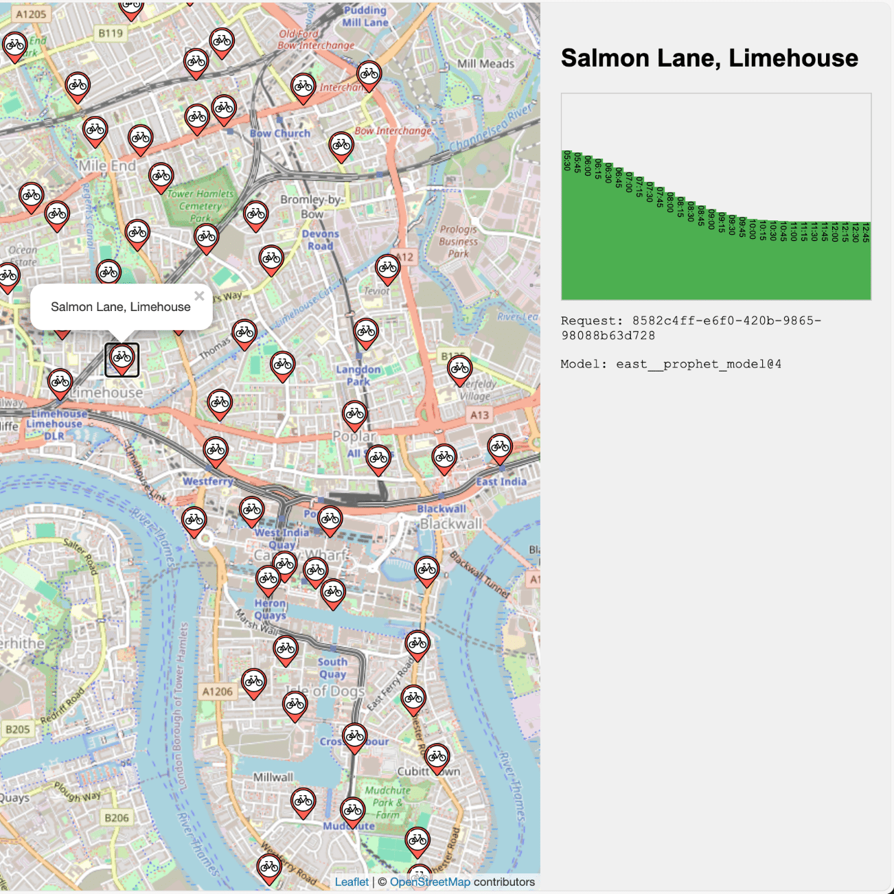
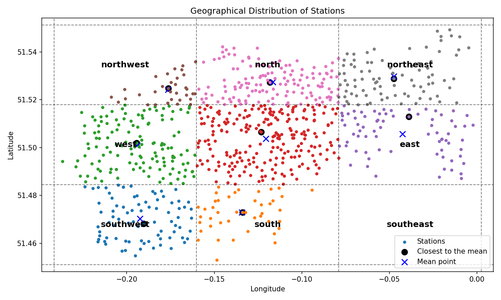

# London Cycle Hire Scheme Prediction

> [!WARNING]
> Esta documentación fue traducida automáticamente del archivo original [readme.md](readme.md).

El objetivo de este proyecto es predecir la tasa de ocupación de cada estación en la red de Alquiler de Bicicletas de Londres, utilizando datos históricos de TFL y un algoritmo de pronóstico para calcular qué tan llena estará una estación de acoplamiento en el futuro.

Vea una captura de pantalla del resultado a continuación:



## Modelado

Hay más de 800 estaciones de acoplamiento en toda la red, por lo tanto, el enfoque que seguimos es dividir las estaciones en regiones según su ubicación geográfica, dividiendo el área de cobertura en una cuadrícula, donde cada cuadrícula tiene su propio modelo:



Como se muestra arriba, para cada una de las regiones se calcula la media y se selecciona la estación más cercana.

### Modelo

Este proyecto utiliza [Prophet de Facebook](https://facebook.github.io/prophet/). De su sitio web:

 > Prophet es un procedimiento para pronosticar datos de series temporales basado en un modelo aditivo donde las tendencias no lineales se ajustan con estacionalidad anual, semanal y diaria, más efectos de días festivos. Funciona mejor con series temporales que tienen fuertes efectos estacionales y varios años de datos históricos. Prophet es robusto frente a datos faltantes y cambios en la tendencia, y típicamente maneja bien los valores atípicos.

## Datos

Los datos para este proyecto provienen de las APIs de TFL, recolectados regularmente en estos repositorios: [fferegrino/london-cycles-db](https://github.com/fferegrino/london-cycles-db) y [fferegrino/weekly-london-cycles-db](https://github.com/fferegrino/weekly-london-cycles-db)

## Inferencia

El modelo se sirve para producir predicciones bajo demanda, cada vez que un usuario selecciona una estación, el modelo produce nuevos valores para presentar al usuario.

Como se muestra arriba, las predicciones se sirven a través de una interfaz web.

## Arquitectura completa de la solución


Este diagrama ilustra la arquitectura y el flujo de trabajo de la aplicación de predicción de ocupación de la red de Alquiler de Bicicletas de Londres.

### Infraestructura de Entrenamiento:
   - Consta de tres elementos principales: minio, MLflow y PostgreSQL – todos accesibles externamente a través del servidor MLOps
   - Estos componentes interactúan entre sí y son utilizados principalmente por los Ingenieros de ML

### GitHub Actions / CICD:
   - Incluye pipeline de pruebas, entrenamiento de modelos y despliegue de App/Infra
   - Estos pipelines se activan por cambios de código del ingeniero de MLOps, ingeniero Frontend e Ingeniero de ML

### Infraestructura de Servicio:
   - Contiene Elastic, Logstash y Kibana (stack ELK) para monitoreo
   - Incluye un servicio de Predicción que envía logs al stack ELK y sirve predicciones a la aplicación frontend

### Interacción del Usuario:
   - Los usuarios acceden al Mapa de Ciclos/Frontend a través de un navegador web

### Datos y Flujo de Trabajo:
   - La Infraestructura de Entrenamiento alimenta el proceso de GitHub Actions/CICD
   - El proceso CICD despliega a la infraestructura de servicio
   - El servicio de predicción interactúa tanto con la Infraestructura de Entrenamiento como con el frontend

### Roles:
   - Ingeniero de ML: Modifica el código de entrenamiento, agrega mejoras al modelo y contribuye a otros cambios de código
   - Ingeniero de MLOps: Gestiona la infraestructura de entrenamiento y servicio, observa el comportamiento del modelo a través de los logs
   - Ingeniero Frontend: Contribuye a cambios de código en el producto final del usuario
   - Usuario: Interactúa con el producto final a través de un navegador web

Esta arquitectura permite la integración y despliegue continuos de la aplicación, con componentes separados para entrenar el modelo de predicción, servir las predicciones y presentar los resultados a los usuarios. Incorpora prácticas modernas de DevOps y MLOps para asegurar un desarrollo y despliegue eficientes del modelo de aprendizaje automático para predecir las tasas de ocupación de las estaciones de alquiler de bicicletas.

## Limitaciones

A continuación se presenta una lista no exhaustiva de las limitaciones actuales de esta solución.

### La forma en que se seleccionan los modelos

Actualmente, se seleccionan datos de un solo punto para construir un modelo, este único punto de datos puede no ser representativo de su región, algunas propuestas de mejora son:

 - Crear clusters de estaciones que comparten patrones de comportamiento

 - Crear clusters más pequeños basados en divisiones geográficas

### Los modelos se entrenan secuencialmente

Una vez que hemos determinado qué modelos se necesitan, se entrenan uno tras otro, sin embargo, esta acción podría realizarse en paralelo para acelerar el paso de entrenamiento.

### Las características utilizadas para el modelo

El modelo elegido, Prophet de Facebook, se basa en una sola característica para pronosticar el futuro; sin embargo, creo que podríamos usar algunos datos meteorológicos para informar mejor las predicciones.

### No hay caché en el servicio de predicción

Actualmente, todas las solicitudes de predicciones se sirven frescas, pero almacenarlas en caché sería una buena opción para evitar sobrecargar el servicio de predicción.

### No hay evaluación de rendimiento en vivo

A pesar de recopilar algunos logs, no estamos realizando ningún análisis post-despliegue del modelo para evaluar su rendimiento en solicitudes iniciadas por usuarios en el mundo real.

### Este proyecto está actualmente destinado a ejecutarse localmente

No se han hecho previsiones para ejecutar este proyecto utilizando ninguna infraestructura en la nube.

---

## Ejecutar localmente

> [!NOTA]
> Este proyecto fue creado originalmente en una Mac usando Apple Silicon, así que ten en cuenta que es posible que necesites eliminar algunas referencias a la plataforma `linux/amd64` dispersas en el código base.

### Requisitos

 - [Docker](https://www.docker.com/)
 - [act](https://github.com/nektos/act) - Ejecuta tus GitHub Actions localmente 🚀

Crea un entorno virtual de Python e instala las dependencias en `model/requirements.txt`:

```bash
pip install -r model/requirements.txt
```

Crea una red de docker:

```
docker network create shared_network
```

Inicia la infraestructura de **entrenamiento** con:

```bash
docker compose --env-file training.env -f training.docker-compose.yml up
```

Inicia la infraestructura de **servicio** con:

```bash
docker compose -f serving.docker-compose.yml up
```

Crea un patrón de índice en Elastic:

```bash
python monitoring/create_index_pattern.py
```

Inicia el entrenamiento usando `act` para simular GitHub Actions con:

```bash
act --container-architecture linux/amd64 --env-file actions.env
```

O usando el flujo de trabajo de entrenamiento local con:

```bash
./model/training.sh
```

### URLs relevantes

 - Frontend [http://localhost:5002/](http://localhost:5002/)
 - Prediction service [http://localhost:5001/](http://localhost:5001/)
 - Elastic [http://localhost:5601/](http://localhost:5601/)
 - MLflow [http://localhost:5555](http://localhost:5555/)
