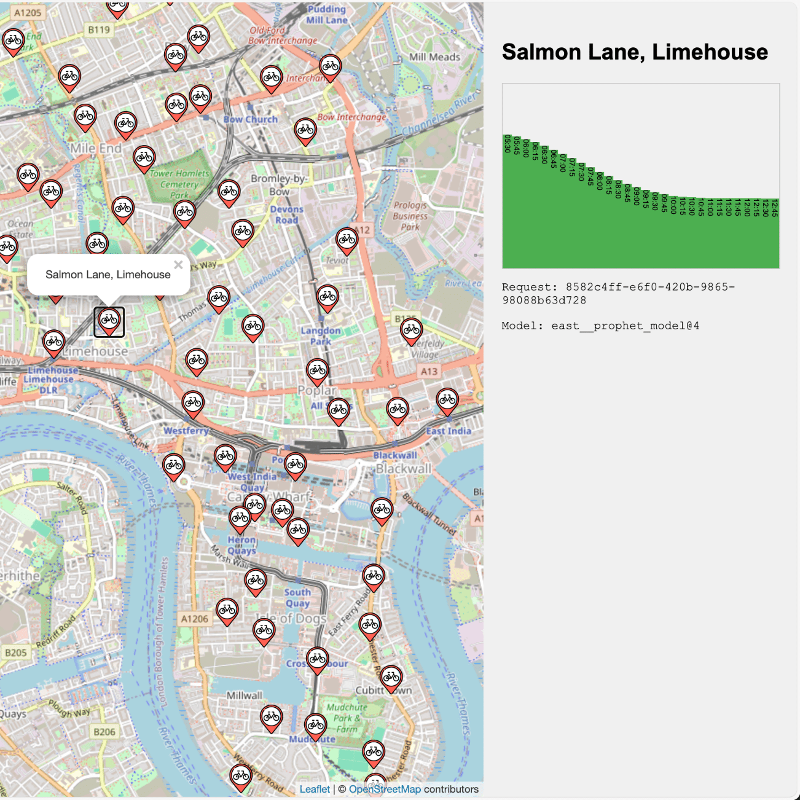
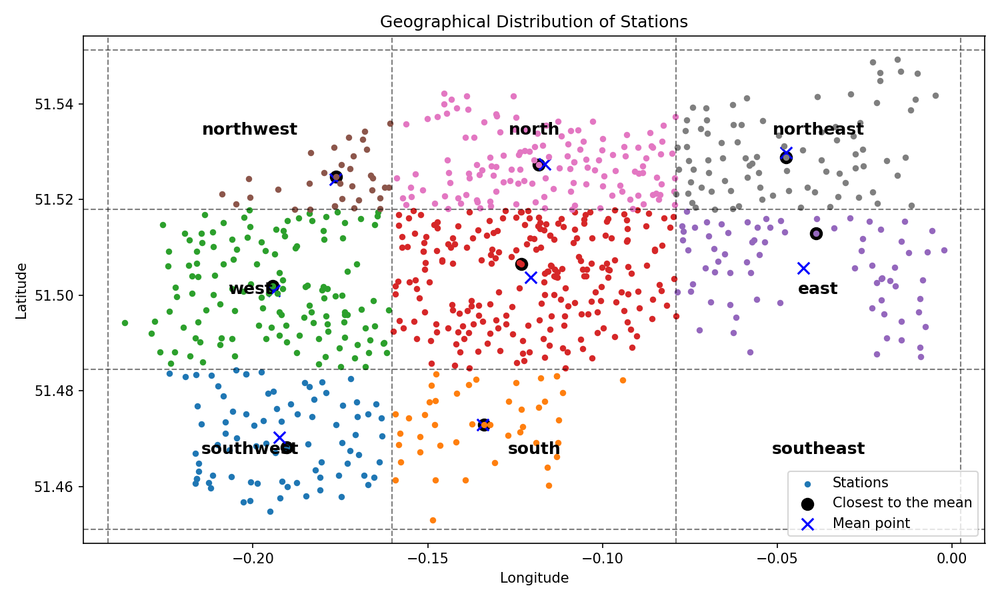
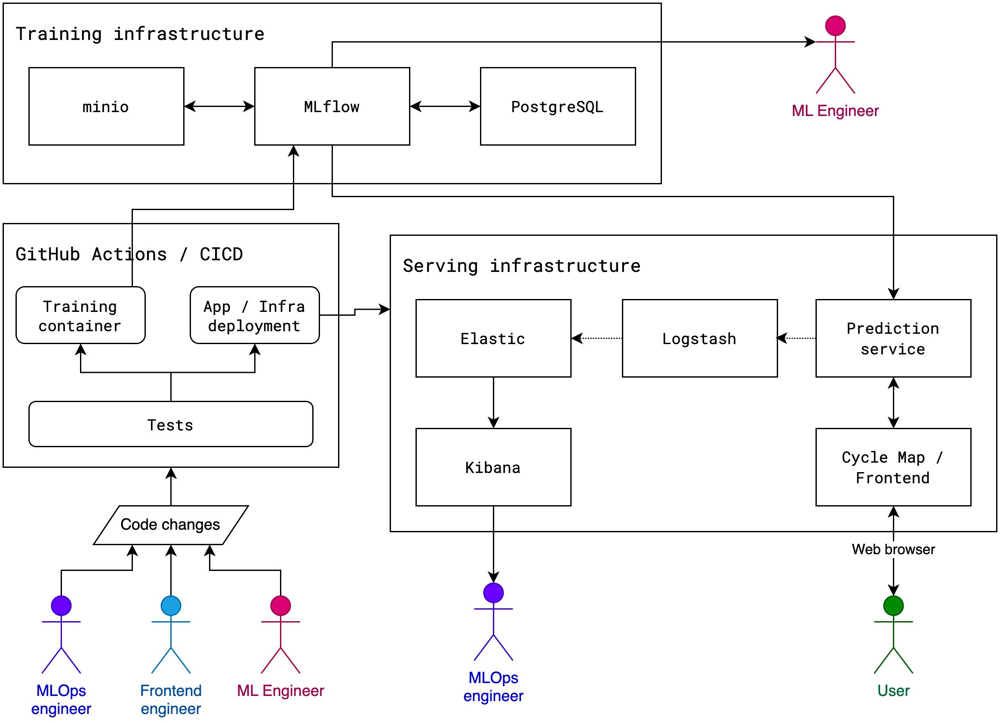

# London Cycle Hire Scheme Prediction

The goal of this project is to predict the occupancy rate of each station in the London Cycle Hire network, it uses historical data from TFL and a forecasting algorithm to calculate how full a given docking station will be in the future.

See a screenshot of the result below:




## Modelling

There are more than 800 docking stations in the whole network, therefore the approach we follow is to divide the stations into regions given their geographical location by dividing the area of coverage into a grid, where each grid has a model of its own:



As shown above, for each one of the regions the mean is calculated and the closest station is selected.

### Model

This project uses [Facebook's Prophet](https://facebook.github.io/prophet/). From their website:

 > Prophet is a procedure for forecasting time series data based on an additive model where non-linear trends are fit with yearly, weekly, and daily seasonality, plus holiday effects. It works best with time series that have strong seasonal effects and several seasons of historical data. Prophet is robust to missing data and shifts in the trend, and typically handles outliers well.

## Data


## Inference

The model is served to produce predictions on demand, whenever a user selects a station, the model produces new values to present to the user.

As shown above, the predictions are served through a web interface.

## Full solution architecture



This diagram illustrates the architecture and workflow of the London Cycle Hire network occupancy prediction app.

### Training Infrastructure:
   - Consists of three main elements: minio, MLflow, and PostgreSQL – all accessed externally through the MLOps server
   - These components interact with each other and are mainly used the ML Engineers

### GitHub Actions / CICD:
   - Includes testing, model training and App/Infra deployment pipeline
   - These pipelines are triggered by code changes from MLOps engineer, Frontend engineer, and ML Engineer

### Serving Infrastructure:
   - Contains Elastic, Logstash, and Kibana (ELK stack) for monitoring.
   - Includes a Prediction service that sends logs to the ELK stack, and serves predictions to the frontend application

### User Interaction:
   - Users access the Cycle Map/Frontend through a web browser

### Data and Workflow:
   - The Training Infrastructure feeds into the GitHub Actions/CICD process
   - The CICD process deploys to the serving infrastructure
   - The prediction service interacts with both the Training Infrastructure and the frontend

### Roles:
   - ML Engineer: Modifies the training code, adds improvement to the model and contributes to other code changes
   - MLOps engineer: Manages the training and serving infrastructure, observes the model behaviour through the logs
   - Frontend engineer: Contributes to code changes to the user's end product
   - User: Interacts with the final product through a web browser

This architecture allows for continuous integration and deployment of the app, with separate components for training the prediction model, serving the predictions, and presenting the results to users. It incorporates modern DevOps and MLOps practices to ensure efficient development and deployment of the machine learning model for predicting cycle hire station occupancy rates.

## Limitations

Below is a non-comprehensive list of current limitations of this solution.

### The way the models are selected

Currently, data from a single point is selected to build a model, this single datapoint may not be representative of its region, some improvement proposals are:

 - Create clusters of stations that share patterns of behaviours

 - Create smaller clusters based on geographical divisions

### The models are trained sequentially

Once we have determined which models are needed, they are trained one after the other, however, this action could be performed in parallel in order to speed up the training step.

### The features used for the model

The chosen model, Facebook's Prophet, relies on a single feature to forecast the future; however, I believe we could use some weather data to better inform the predictions.

### There is no caching in the prediction service

Currently, all requests for predictions are served afresh, but caching them would be a good option to avoid overloading the prediction service.

---

## Run locally

> [!NOTE]
> This project was originally created on a Mac using Apple Silicon, so be aware that you may need to remove a few references to the `linux/amd64` platform scattered in the codebase.

### Requirements

 - [Docker](https://www.docker.com/)
 - [act](https://github.com/nektos/act) - Run your GitHub Actions locally 🚀

Create a Python virtual environment and install the dependencies in `model/requirements.txt`:

```bash
pip install -r model/requirements.txt
```

Create a docker network:

```
docker network create shared_network
```

Start the **training** infrastructure with:

```bash
docker compose --env-file training.env -f training.docker-compose.yml up
```

Start the **serving** infrastructure with:

```bash
docker compose -f serving.docker-compose.yml up
```

Create an index pattern in Elastic:

```bash
python monitoring/create_index_pattern.py
```

Kickstart the training using `act` to simulate GitHub Actions with:

```bash
act --container-architecture linux/amd64 --env-file actions.env
```

Or using the local training workflow with:

```bash
./model/training.sh
```

### Relevant urls

 - Frontend [http://localhost:5002/](http://localhost:5002/)
 - Prediction service [http://localhost:5001/](http://localhost:5001/)
 - Elastic [http://localhost:5601/](http://localhost:5601/)
 - MLflow [http://localhost:5555](http://localhost:5555/)
